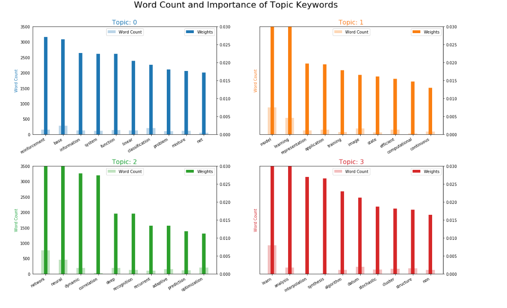
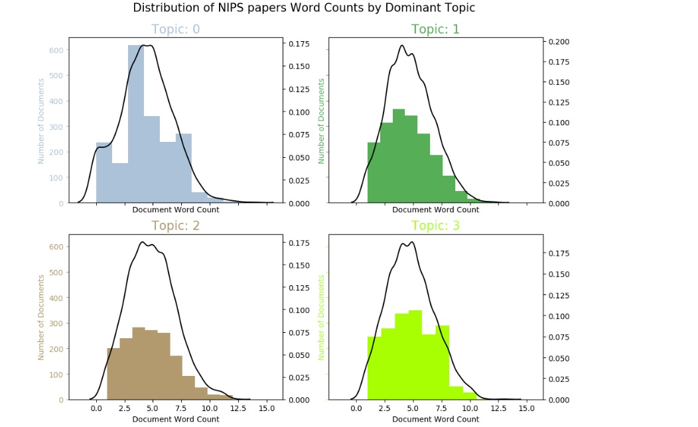

# Topic Modeling with Latent Dirichlet Allocation (LDA) for NIPS papers

Neural Information Processing Systems (NIPS) is one of the top machine learning conferences in the world where groundbreaking work is published. Since the year 1987, a lot of exciting work has been published in this confernece, but are the trends in recent machine learning research published to this Journal. The object of this project is to analyze a large collection of NIPS research papers from the past decades to discover the latest trends in machine learning.

## Data 
The data was gotten from  [Kaggle](https://www.kaggle.com/benhamner/nips-papers) and includes the `title`, `authors`, `abstracts`, and `extracted text` for all NIPS papers up to 2017 (ranging from the first 1987 conference to the current 2016 conference).

## Method
- The data was first cleaned and processed using:
  - Regular Expression/Normalization — to convert text to lowercase and remove punctuation and numbers
  - Stop Words Removal — to remove commonly used words in any language
  - Tokenization — to split the text into smaller pieces called tokens
  - Bigram, Trigram Models and Lemmatized - to group together the inflected forms of a word so they can be analyzed as a single item
  
After processing the data, I followed a structured workflow to build an insightful topic model based on the Latent Dirichlet Allocation (LDA) algorithm. The topic model was built using gensim’s native `LdaModel` and visualized the results using matplotlib plots.

Next steps:
- Built the LDA topic model using LdaModel(), the corpus and the dictionary.

I answered the following questions graphically:
- Dominant topic and its percentage contribution in each document
- The most representative sentence for each topic
- What are the most discussed topics in the documents?

Finally, I visualized:
- The information using `pyLavis`.
- Theclusters of documents using `t-SNE` (t-distributed stochastic neighbor embedding) algorithm

## Results
| <a href="https://github.com/LotaIbe/topic-modeling-nips">    | <a href="https://github.com/LotaIbe/topic-modeling-nips">  |
|--------------------------------------------------------------------------------------------|-------------------------------------------------------------------------------------------------|
| <a href="https://github.com/LotaIbe/topic-modeling-nips">   | <a href="https://github.com/LotaIbe/topic-modeling-nips">     |

